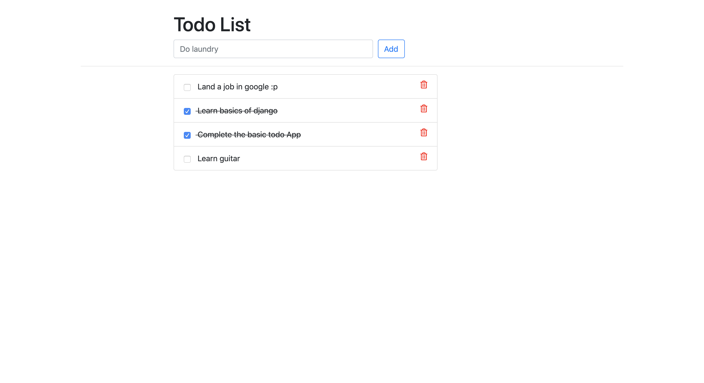

## Todo-Web Readme

Welcome to Todo-Web! This is a simple and efficient web-based todo list application that helps you stay organized and focused on your tasks. Whether you're an individual looking for a personal task manager or a team collaborating on a project, Todo-Web is designed to cater to your productivity needs.

## Table of Contents

- [Introduction](#introduction)
- [Features](#features)
- [Usage](#usage)
- [Contributing](#contributing)
- [License](#license)

## Introduction

Todo-Web is a project that aims to simplify task management and provide a user-friendly experience. It allows you to create, update, and delete tasks while keeping everything organized in one place. The application is built using modern web technologies to ensure responsiveness and ease of use on various devices.

## Features

- **User Authentication**: Securely sign up and log in to your personalized account.
- **Task Creation**: Add new tasks with a title, description, and due date.
- **Task Management**: Edit, mark as complete, or delete tasks with ease.
- **Categories and Tags**: Organize tasks using categories and tags for better sorting.
- **User Settings**: Customize your profile and preferences.
- **Responsive Design**: Enjoy a seamless experience across desktops, tablets, and smartphones.

## Usage

1. **Sign Up / Log In**:

   Create a new account or log in using your existing credentials.

2. **Dashboard**:

   Once logged in, you'll be directed to the dashboard, where you can view and manage your tasks.

3. **Add Task**:

   Click the "Add Task" button to create a new task. Fill in the required details and save it.

4. **Edit / Complete / Delete Task**:

   Hover over a task to reveal action buttons. Use these buttons to edit, mark as complete, or delete a task.

5. **Categories and Tags**:

   Manage your tasks efficiently by organizing them using categories and tags.

6. **User Settings**:

   Customize your profile and update your preferences in the settings section.

## Contributing

We welcome contributions to enhance Todo-Web and make it even better! If you'd like to contribute, follow these steps:

1. Fork the repository and create a new branch.

2. Make your modifications and improvements.

3. Test your changes thoroughly.

4. Submit a pull request, describing the changes you've made.

5. Wait for the maintainers' review and approval.

## License

Todo-Web is released under the [MIT License](https://github.com/carnageiron/todo-web/blob/main/LICENSE). You are free to use, modify, and distribute this software as per the terms of the license.

---

Thank you for using Todo-Web! If you have any questions, issues, or feedback, please don't hesitate to reach out to us on GitHub. Happy task managing!
